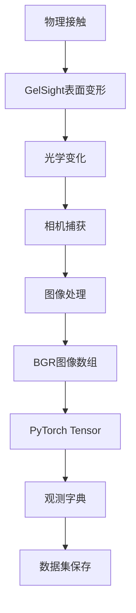

# GelSight 触觉传感器数据格式说明

## 📋 概述

本文档详细说明了GelSight触觉传感器在LeRobot框架中的数据保存格式。GelSight传感器通过高分辨率相机捕获触觉表面的变形，提供丰富的接触信息。

## 🔧 数据格式特点

### 1. 与Tac3D的区别

| 特性 | GelSight | Tac3D |
|------|----------|--------|
| **数据类型** | 图像数据 | 3D位置/力场数据 |
| **数据维度** | 240×320×3 (或自定义) | 400×3 位置点 |
| **数据量/帧** | ~230KB (未压缩) | ~28KB |
| **信息内容** | 视觉纹理变化 | 精确数值位移 |
| **处理方式** | 图像分析 | 数值计算 |

### 2. 保存的数据字段

GelSight传感器保存以下5个数据字段：

| 数据字段 | 形状 | 类型 | 大小 | 描述 |
|---------|------|------|------|------|
| `sensor_sn` | (1,) | string | ~20 bytes | 传感器标识（设备名称） |
| `frame_index` | (1,) | int64 | 8 bytes | 数据帧索引 |
| `send_timestamp` | (1,) | float64 | 8 bytes | 发送时间戳 |
| `recv_timestamp` | (1,) | float64 | 8 bytes | 接收时间戳 |
| `tactile_image` | (H, W, 3) | uint8 | H×W×3 bytes | 触觉图像数据 |

**典型数据量**: ~230KB/帧 (240×320×3的图像)

## 📊 数据存储结构

### 1. 观测字典格式

触觉数据以以下键名存储在观测字典中：

```python
obs = {
    "observation.tactile.{sensor_name}.sensor_sn": "GelSight Mini",
    "observation.tactile.{sensor_name}.frame_index": torch.tensor([12345]),
    "observation.tactile.{sensor_name}.send_timestamp": torch.tensor([1.234567]),
    "observation.tactile.{sensor_name}.recv_timestamp": torch.tensor([1.234568]),
    "observation.tactile.{sensor_name}.tactile_image": torch.tensor([[[...]]]),  # (H,W,3)
}
```

### 2. 图像数据详细说明

#### 图像格式
- **色彩空间**: BGR (Blue-Green-Red)
- **数据类型**: uint8 (0-255)
- **维度顺序**: (Height, Width, Channel)
- **典型尺寸**: 240×320×3

#### 图像内容
- **静态状态**: 传感器表面的原始纹理
- **接触状态**: 表面变形导致的纹理变化
- **变形信息**: 通过光学变化反映接触压力和形状

### 3. 数据流程图



## 🔄 数据采集实现

### 1. 传感器配置

```python
from lerobot.common.robot_devices.tactile_sensors.configs import GelSightConfig

config = GelSightConfig(
    device_name="GelSight Mini",    # 传感器设备名
    imgh=240,                       # 图像高度
    imgw=320,                       # 图像宽度
    raw_imgh=2464,                  # 原始图像高度
    raw_imgw=3280,                  # 原始图像宽度
    framerate=25,                   # 帧率
)
```

### 2. 数据读取

```python
from lerobot.common.robot_devices.tactile_sensors.gelsight import GelSightSensor

sensor = GelSightSensor(config)
sensor.connect()

# 读取单帧数据
data = sensor.read()

# 数据格式
print(f"传感器SN: {data['SN']}")
print(f"帧索引: {data['index']}")
print(f"图像形状: {data['tactile_image'].shape}")
print(f"图像类型: {data['tactile_image'].dtype}")
```

### 3. 机器人集成

```python
from lerobot.common.robot_devices.robots.configs import AlohaRobotConfig

config = AlohaRobotConfig(
    tactile_sensors={
        "right_finger": GelSightConfig(
            device_name="GelSight Mini",
            imgh=240,
            imgw=320,
            framerate=30,
        ),
    }
)

robot = ManipulatorRobot(config)
robot.connect()

# 采集观测数据
obs = robot.capture_observation()

# 访问触觉图像
image = obs["observation.tactile.right_finger.tactile_image"]
print(f"触觉图像: {image.shape}, dtype: {image.dtype}")
```

## 💾 数据集保存

### 1. 创建数据集

```python
from lerobot.common.datasets.lerobot_dataset import LeRobotDataset

# 创建包含触觉数据的数据集
dataset = LeRobotDataset.create(
    "gelsight_manipulation",
    fps=30,
    root="./data",
    robot=robot,  # 自动包含触觉特征
    use_videos=True,  # 启用视频压缩
)
```

### 2. 记录数据

```python
# 记录单个episode
for step in range(100):
    obs = robot.capture_observation()
    action = get_action()  # 获取动作
    
    frame = {
        **obs,
        **action,
        "task": "tactile_manipulation"
    }
    
    dataset.add_frame(frame)

# 保存episode
dataset.save_episode()
```

### 3. 数据访问

```python
# 加载数据集
dataset = LeRobotDataset("gelsight_manipulation", root="./data")

# 访问样本
sample = dataset[0]

# 提取触觉图像
tactile_image = sample["observation.tactile.right_finger.tactile_image"]
print(f"Shape: {tactile_image.shape}")  # (240, 320, 3)
print(f"Range: [{tactile_image.min()}, {tactile_image.max()}]")  # [0, 255]
```

## 📈 数据处理与分析

### 1. 图像预处理

```python
import cv2
import numpy as np

def preprocess_tactile_image(image):
    """预处理触觉图像"""
    # 转换为numpy数组
    if hasattr(image, 'numpy'):
        image = image.numpy()
    
    # 归一化到[0,1]
    normalized = image.astype(np.float32) / 255.0
    
    # 可选：转换为灰度图
    gray = cv2.cvtColor(image, cv2.COLOR_BGR2GRAY)
    
    return normalized, gray

# 使用示例
tactile_image = obs["observation.tactile.right_finger.tactile_image"]
normalized, gray = preprocess_tactile_image(tactile_image)
```

### 2. 接触检测

```python
def detect_contact(image, baseline_image=None):
    """检测接触区域"""
    if baseline_image is not None:
        # 计算与基准图像的差异
        diff = cv2.absdiff(image, baseline_image)
        
        # 阈值化
        _, mask = cv2.threshold(diff, 30, 255, cv2.THRESH_BINARY)
        
        # 形态学操作去噪
        kernel = np.ones((3,3), np.uint8)
        mask = cv2.morphologyEx(mask, cv2.MORPH_OPEN, kernel)
        
        return mask
    
    return None

# 使用示例
contact_mask = detect_contact(current_image, baseline_image)
contact_area = np.sum(contact_mask > 0)
print(f"接触面积: {contact_area} 像素")
```

### 3. 特征提取

```python
def extract_tactile_features(image):
    """提取触觉特征"""
    features = {}
    
    # 基本统计特征
    features['mean_intensity'] = np.mean(image)
    features['std_intensity'] = np.std(image)
    
    # 纹理特征 (LBP)
    from skimage.feature import local_binary_pattern
    gray = cv2.cvtColor(image, cv2.COLOR_BGR2GRAY)
    lbp = local_binary_pattern(gray, 24, 8, method='uniform')
    features['lbp_hist'] = np.histogram(lbp, bins=26)[0]
    
    # 边缘特征
    edges = cv2.Canny(gray, 50, 150)
    features['edge_density'] = np.sum(edges > 0) / edges.size
    
    return features
```

## 📊 性能分析

### 1. 存储效率

| 配置 | 图像尺寸 | 数据量/帧 | 30fps数据率 |
|------|----------|-----------|------------|
| 低分辨率 | 120×160×3 | ~58KB | ~1.7MB/s |
| 标准分辨率 | 240×320×3 | ~230KB | ~6.9MB/s |
| 高分辨率 | 480×640×3 | ~920KB | ~27.6MB/s |

### 2. 处理性能

```python
import time

def benchmark_tactile_processing():
    """性能基准测试"""
    
    # 创建测试图像
    test_image = np.random.randint(0, 255, (240, 320, 3), dtype=np.uint8)
    
    # 测试读取速度
    start_time = time.time()
    for i in range(100):
        data = sensor.read()
    read_time = (time.time() - start_time) / 100
    
    # 测试处理速度
    start_time = time.time()
    for i in range(100):
        features = extract_tactile_features(test_image)
    process_time = (time.time() - start_time) / 100
    
    print(f"平均读取时间: {read_time*1000:.2f} ms")
    print(f"平均处理时间: {process_time*1000:.2f} ms")
    print(f"理论最大帧率: {1/(read_time+process_time):.1f} fps")
```

## ⚡ 优化建议

### 1. 降低数据量

```python
# 方法1: 降低分辨率
config = GelSightConfig(
    imgh=120,  # 降低到120
    imgw=160,  # 降低到160
    framerate=30,
)

# 方法2: 降低帧率
config = GelSightConfig(
    framerate=15,  # 降低到15fps
)

# 方法3: ROI裁剪
def crop_roi(image, x, y, w, h):
    """裁剪感兴趣区域"""
    return image[y:y+h, x:x+w]
```

### 2. 数据压缩

```python
# 在数据集创建时启用视频压缩
dataset = LeRobotDataset.create(
    "gelsight_data",
    fps=30,
    root="./data",
    robot=robot,
    use_videos=True,  # 启用压缩
    image_writer_processes=4,  # 多进程写入
)
```

### 3. 实时优化

```python
def optimized_tactile_loop():
    """优化的触觉数据处理循环"""
    
    # 预分配缓冲区
    buffer = np.zeros((240, 320, 3), dtype=np.uint8)
    
    # 批量处理
    batch_size = 10
    image_batch = []
    
    while True:
        # 读取数据
        data = sensor.read()
        if data and 'tactile_image' in data:
            image_batch.append(data['tactile_image'])
            
            # 批量处理
            if len(image_batch) >= batch_size:
                process_batch(image_batch)
                image_batch = []
```

## 🔍 调试与故障排除

### 1. 数据验证

```python
def validate_tactile_data(obs, sensor_name):
    """验证触觉数据完整性"""
    base_key = f"observation.tactile.{sensor_name}"
    
    # 检查必需字段
    required_fields = [
        "sensor_sn", "frame_index", 
        "send_timestamp", "recv_timestamp", 
        "tactile_image"
    ]
    
    for field in required_fields:
        key = f"{base_key}.{field}"
        if key not in obs:
            print(f"❌ 缺失字段: {key}")
            return False
        
        data = obs[key]
        if field == "tactile_image":
            if data.shape != (240, 320, 3):  # 检查形状
                print(f"❌ 图像形状错误: {data.shape}")
                return False
            if data.dtype != torch.uint8:  # 检查类型
                print(f"❌ 图像类型错误: {data.dtype}")
                return False
        
        print(f"✅ {field}: OK")
    
    return True
```

### 2. 可视化工具

```python
def visualize_tactile_data(tactile_image, save_path=None):
    """可视化触觉数据"""
    import matplotlib.pyplot as plt
    
    # 转换为numpy数组
    if hasattr(tactile_image, 'numpy'):
        image = tactile_image.numpy()
    else:
        image = tactile_image
    
    # BGR转RGB用于显示
    image_rgb = cv2.cvtColor(image, cv2.COLOR_BGR2RGB)
    
    plt.figure(figsize=(10, 6))
    
    # 原始图像
    plt.subplot(1, 3, 1)
    plt.imshow(image_rgb)
    plt.title('原始触觉图像')
    plt.axis('off')
    
    # 灰度图
    gray = cv2.cvtColor(image, cv2.COLOR_BGR2GRAY)
    plt.subplot(1, 3, 2)
    plt.imshow(gray, cmap='gray')
    plt.title('灰度图')
    plt.axis('off')
    
    # 直方图
    plt.subplot(1, 3, 3)
    plt.hist(gray.flatten(), bins=50, alpha=0.7)
    plt.title('灰度直方图')
    plt.xlabel('像素值')
    plt.ylabel('频次')
    
    if save_path:
        plt.savefig(save_path)
    plt.show()
```

## 📚 总结

GelSight触觉传感器的数据格式设计具有以下特点：

1. **图像为主**: 以高分辨率图像作为主要数据载体
2. **标准化接口**: 符合LeRobot的数据格式规范
3. **元数据完整**: 包含时间戳和索引信息
4. **处理灵活**: 支持多种图像分析方法
5. **扩展性强**: 易于添加新的处理算法

这种数据格式为机器人的视觉触觉感知提供了丰富的信息，支持复杂的接触分析和智能操作决策。 