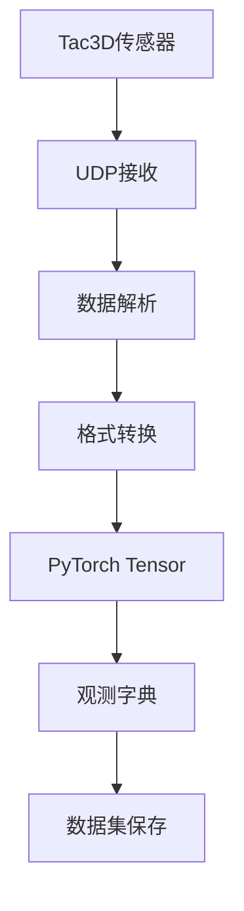

# 🤚 触觉传感器完整数据保存功能

## 📋 概述

本文档介绍了LeRobot框架中触觉传感器完整数据保存功能的实现。相比之前只保存合成力和力矩，现在可以保存触觉传感器的所有原始数据，为机器学习和分析提供更丰富的信息。

## 🔧 实现的功能

### 1. 完整数据保存

现在保存的触觉数据包含以下9个字段：

| 数据字段 | 形状 | 类型 | 大小 | 描述 |
|---------|------|------|------|------|
| `sensor_sn` | (1,) | string | 50 bytes | 传感器序列号 |
| `frame_index` | (1,) | int64 | 8 bytes | 数据帧索引 |
| `send_timestamp` | (1,) | float64 | 8 bytes | 发送时间戳 |
| `recv_timestamp` | (1,) | float64 | 8 bytes | 接收时间戳 |
| `positions_3d` | (400, 3) | float64 | 9.4 KB | 400个标志点的3D坐标 |
| `displacements_3d` | (400, 3) | float64 | 9.4 KB | 400个标志点的3D位移 |
| `forces_3d` | (400, 3) | float64 | 9.4 KB | 400个点的局部受力 |
| `resultant_force` | (3,) | float64 | 24 bytes | 合成力向量 |
| `resultant_moment` | (3,) | float64 | 24 bytes | 合成力矩向量 |

**总数据量**: 28.2 KB/帧 (相比之前的24字节增加了1205倍)

### 2. 数据存储结构

触觉数据以以下键名存储在观测字典中：
```python
obs = {
    "observation.tactile.{sensor_name}.sensor_sn": "AD2-0047L",
    "observation.tactile.{sensor_name}.frame_index": torch.tensor([12345]),
    "observation.tactile.{sensor_name}.send_timestamp": torch.tensor([1.234567]),
    "observation.tactile.{sensor_name}.recv_timestamp": torch.tensor([1.234568]),
    "observation.tactile.{sensor_name}.positions_3d": torch.tensor([[x,y,z], ...]),  # (400,3)
    "observation.tactile.{sensor_name}.displacements_3d": torch.tensor([[dx,dy,dz], ...]),  # (400,3)
    "observation.tactile.{sensor_name}.forces_3d": torch.tensor([[fx,fy,fz], ...]),  # (400,3)
    "observation.tactile.{sensor_name}.resultant_force": torch.tensor([fx, fy, fz]),
    "observation.tactile.{sensor_name}.resultant_moment": torch.tensor([mx, my, mz]),
}
```

## 🔄 数据流程

### 1. 数据收集流程



### 2. 具体实现

在 `ManipulatorRobot.capture_observation()` 方法中：

```python
# 读取触觉传感器数据
for name in self.tactile_sensors:
    data = self.tactile_sensors[name].read()
    
    if data:
        # 基本元数据
        tactile_data[f"{name}_sensor_sn"] = data.get('SN', '')
        tactile_data[f"{name}_frame_index"] = torch.tensor([data.get('index', 0)], dtype=torch.int64)
        tactile_data[f"{name}_send_timestamp"] = torch.tensor([data.get('sendTimestamp', 0.0)], dtype=torch.float64)
        tactile_data[f"{name}_recv_timestamp"] = torch.tensor([data.get('recvTimestamp', 0.0)], dtype=torch.float64)
        
        # 三维数据阵列
        if '3D_Positions' in data and data['3D_Positions'] is not None:
            positions = data['3D_Positions']
            tactile_data[f"{name}_positions_3d"] = torch.from_numpy(positions.astype(np.float64))
        
        # ... 其他数据字段处理
```

## 📊 与其他传感器的对比

| 传感器类型 | 数据量/帧 | 存储方式 | 特点 |
|----------|-----------|----------|------|
| **相机** | ~100KB-1MB | 视频压缩 | 空间感知，压缩效率高 |
| **电机** | ~100字节 | 直接数值 | 状态信息，数据量小 |
| **触觉(原)** | 24字节 | 直接数值 | 仅合成力矩，信息有限 |
| **触觉(新)** | ~28KB | 直接数值 | 完整3D信息，丰富细节 |

## 🎯 应用场景

### 1. 高精度操作
- **精密装配**: 利用力分布信息进行精确定位
- **表面检测**: 通过位移和力场识别表面特征
- **接触质量**: 分析接触点分布和压力均匀性

### 2. 机器学习应用
- **多模态学习**: 结合视觉、触觉、运动信息
- **力感知策略**: 基于详细力场信息的控制策略
- **材质识别**: 通过力分布模式识别不同材质

### 3. 数据分析
- **接触可视化**: 绘制力分布热图
- **时序分析**: 跟踪标志点运动轨迹
- **异常检测**: 检测异常的力分布模式

## 🚀 使用方法

### 1. 基本配置

```python
from lerobot.common.robot_devices.robots.configs import AlohaRobotConfig
from lerobot.common.robot_devices.tactile_sensors.configs import Tac3DConfig

config = AlohaRobotConfig(
    tactile_sensors={
        "left_gripper": Tac3DConfig(
            port=9988,
            auto_calibrate=True,
            mock=False,  # 使用真实传感器
        ),
        "right_gripper": Tac3DConfig(
            port=9989,
            auto_calibrate=True,
            mock=False,
        ),
    }
)
```

### 2. 数据收集

```python
robot = ManipulatorRobot(config)
robot.connect()

# 单次观测
obs = robot.capture_observation()

# 查看触觉数据
sensor_name = "left_gripper"
positions = obs[f"observation.tactile.{sensor_name}.positions_3d"]
forces = obs[f"observation.tactile.{sensor_name}.forces_3d"]
resultant_force = obs[f"observation.tactile.{sensor_name}.resultant_force"]

print(f"3D位置数据: {positions.shape}")
print(f"3D力场数据: {forces.shape}")
print(f"合成力: {resultant_force}")
```

### 3. 数据集保存

```python
from lerobot.common.datasets.lerobot_dataset import LeRobotDataset

# 创建数据集
dataset = LeRobotDataset.create(
    "tactile_dataset",
    fps=30,
    root="./data",
    features=robot.features,  # 自动包含完整触觉特征
)

# 记录数据
while collecting:
    obs, action = robot.teleop_step(record_data=True)
    frame = {**obs, **action, "task": "manipulation_task"}
    dataset.add_frame(frame)

# 保存episode
dataset.save_episode()
```

### 4. 数据访问

```python
# 加载数据集
dataset = LeRobotDataset("tactile_dataset", root="./data")

# 访问样本
sample = dataset[0]

# 提取触觉数据
sensor_name = "left_gripper"
positions_3d = sample[f"observation.tactile.{sensor_name}.positions_3d"]
forces_3d = sample[f"observation.tactile.{sensor_name}.forces_3d"]

# 数据分析
force_magnitude = torch.norm(forces_3d, dim=1)  # 每个点的力大小
contact_points = positions_3d[force_magnitude > threshold]  # 接触点
```

## 📈 性能考虑

### 1. 存储效率
- **优势**: 无损保存完整信息
- **成本**: 数据量增加~1200倍
- **建议**: 根据应用需求选择保存粒度

### 2. 计算效率  
- **读取速度**: 直接从内存访问，速度快
- **处理复杂度**: 3D数据需要更多计算资源
- **优化建议**: 可选择性使用部分数据字段

### 3. 传输效率
- **实时性**: UDP传输，延迟低
- **带宽**: 约30KB/帧 @ 50Hz = 1.5MB/s
- **压缩**: 可考虑无损压缩减少存储

## ⚡ 优化建议

### 1. 选择性保存
根据应用需求，可以选择只保存部分数据：

```python
# 只保存关键数据
essential_fields = [
    "resultant_force", 
    "resultant_moment", 
    "positions_3d"  # 用于接触检测
]
```

### 2. 数据压缩
对于长期存储，可以考虑压缩：

```python
# 使用较低精度
positions_3d = positions_3d.float()  # float32代替float64
forces_3d = forces_3d.float()
```

### 3. 分层存储
- **实时控制**: 只使用合成力和力矩
- **数据分析**: 保存完整3D数据
- **长期存储**: 压缩或采样

## 🔍 故障排除

### 1. 常见问题

**问题**: 数据全为零
- **原因**: 传感器未初始化或无接触
- **解决**: 检查传感器连接，执行校准

**问题**: 数据量过大
- **原因**: 完整数据包含大量3D信息
- **解决**: 选择性保存或压缩

**问题**: 时间戳不准确
- **原因**: 网络延迟或时钟不同步
- **解决**: 使用接收时间戳或时钟同步

### 2. 调试方法

```python
# 检查数据完整性
def check_tactile_data(obs, sensor_name):
    base_key = f"observation.tactile.{sensor_name}"
    
    required_fields = [
        "sensor_sn", "frame_index", "positions_3d", 
        "forces_3d", "resultant_force"
    ]
    
    for field in required_fields:
        key = f"{base_key}.{field}"
        if key not in obs:
            print(f"❌ 缺失字段: {key}")
        else:
            data = obs[key]
            print(f"✅ {field}: {data.shape if hasattr(data, 'shape') else type(data)}")
```

## 📚 总结

完整的触觉数据保存功能为LeRobot框架提供了：

1. **丰富的感知信息**: 从简单的力矢量扩展到完整的3D触觉场
2. **高精度分析能力**: 支持详细的接触分析和表面检测  
3. **机器学习友好**: 为多模态学习提供高质量训练数据
4. **可扩展架构**: 易于添加新的触觉传感器类型
5. **高效存储**: 与LeRobot数据集无缝集成

这一实现为机器人的触觉感知能力提供了坚实的基础，支持更复杂的操作任务和智能行为的发展。 